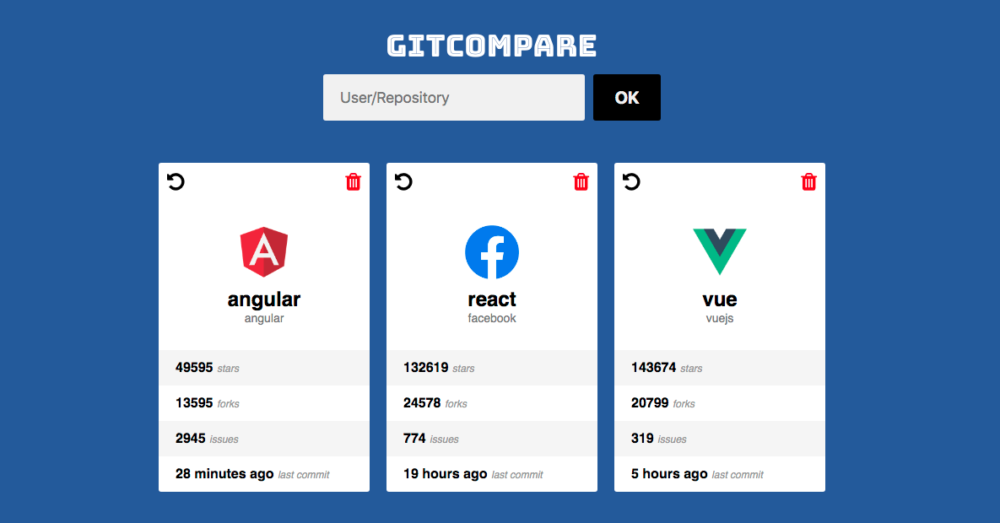

## GITCOMPARE

This is an app to list github repositories and compare them side by side,
you will be able to compare the issues, stars, forks and also see the last commit time.

---

### Installation

- Download the repository
- At the root folder of the repository on the terminal run `yarn` or `npm install`
- After all the dependencies have been installed run `yarn start` or `npm start` to run the project locally.
